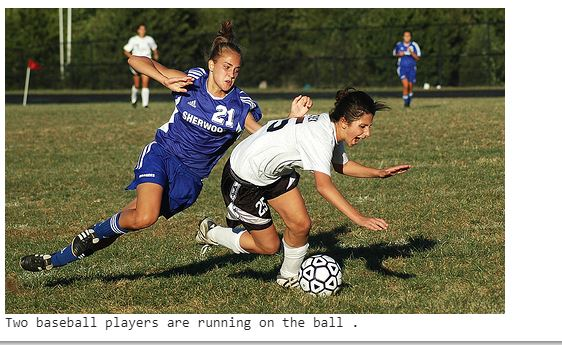

<h1> <strong>Image-Captioning-Project </strong> </h1>

 This Project is build using Neural Network. This Project takes an image as input and generates a description or caption using it

<h1> <strong> Dataset And Intermediate Data Drive link </strong> <h1>

<h1> <strong> DESIGN </strong> </h1>

 This Project consists of various neural models. The different type of model used are :-

<ul>
  <li> <strong> Resnet Model : </strong> This model converts the Images into a 2d array and extract 2048 features.
  <li> <strong> Language Model : </strong> This model consist of LSTM cells and then convert text into 128 feature</li>
  <li> <strong> Image Model : </strong> This model process 2048 features of each image and convert it into 128 features. </li>
  <li> <strong> Combined Model : </strong> This model combines both Language and Image model.</li>
</ul>

<h1><strong> EXAMPLE OF WORKING </strong> </h1>

